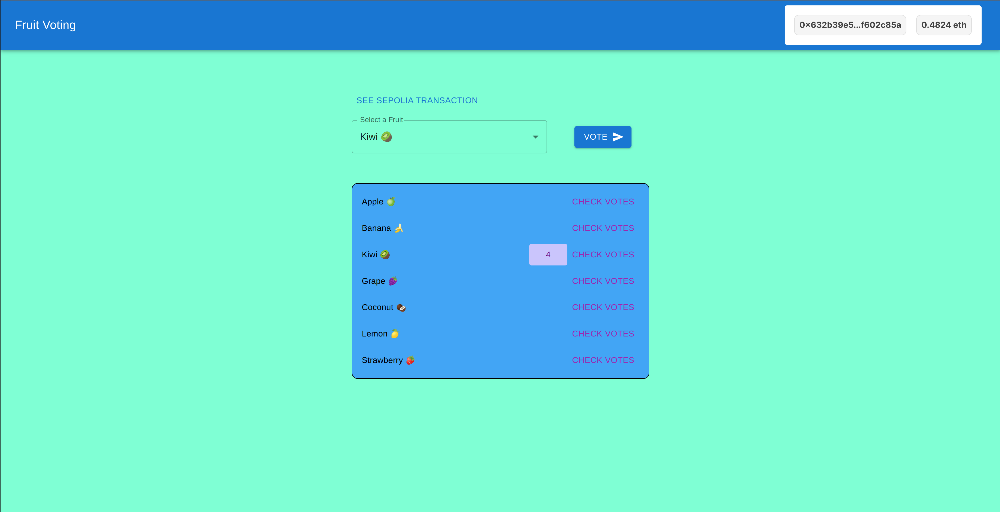

# Web3 Fruit Voting Full Stack App

Welcome to my Web3 Fruit Voting Full Stack App! This application allows users to vote for their favorite fruits and retrieve the total votes for a fruit.



## Project Structure

- **contracts/**: Contains the Solidity smart contract `FruitVoting.sol` where users can vote for a fruit and get the votes a fruit has.
- **backend/**: TypeScript node API exposing the `/vote` and `/getVotes` endpoints for the frontend. Run the backend with `yarn run dev`. Ensure to fill the `.env` file with the necessary API keys. For a full description, check the [README.md](https://github.com/reymom/fruit-voting-web3/tree/main/backend#readme) in the backend folder.
- **frontend/**: Next.js TypeScript React app with MetaMask integration. Users can select a fruit from a dropdown, send votes to the backend, and receive the votes as well. Run the frontend with `npm run dev`.

## Prerequisites

- [Node.js](https://nodejs.org/en/download) > v18

## Development Workflow

### Running the Backend

```bash
cd backend/
npm run dev
yarn run dev
```

### Running the Frontend

```bash
cd frontend/
npm install
npm run dev
```

### Deploying Contracts

```bash
npx hardhat run scripts/deploy_FruitVoting.ts
```

The contract is currently deployed to Sepolia test chain:
[See in sepolia.etherscan.io](https://sepolia.etherscan.io/address/0x9025e74d23384f664cfeb07f1d8abd19570758b5)

### Testing Contracts

```bash
cd tests/
REPORT_GAS=true npx hardhat test
```

## API Endpoints

For a complete overview, refer to [README.md](https://github.com/reymom/fruit-voting-web3/tree/main/backend#readme)

### `GET /vote/:fruitName`

Vote for a specific fruit.

### `GET /getVotes/:fruitName`

Get total votes for a specific fruit.

## MetaMask Integration

The frontend integrates with MetaMask. Ensure MetaMask is installed in your browser and connected to the scroll Ethereum test network.

## Environment Variables

Ensure to set up the following environment variables in your `.env` file:

- `PRIVATE_KEY`: Your wallet private key.
- `INFURA_URL`: Your Infura URL.
